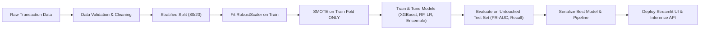

# 💳 Credit Card Fraud Detection System (End-to-End MLOps Pipeline)

[](https://www.python.org/downloads/)
[](LICENSE)
[](https://streamlit.io/)
[](https://scikit-learn.org/)
[](https://xgboost.readthedocs.io/)

A complete, production-grade end-to-end Machine Learning project engineered to identify and intercept fraudulent credit card transactions in real-time. Built specifically for college viva, technical interviews, resumes, and portfolio demonstrations.

---

## 📌 1. Project Overview & Problem Statement

Credit card fraud presents a high-stakes challenge for modern banking and payment processors. Fraud represents a **severe class imbalance** problem where legitimate transactions comprise **>99.8%** of total volume while fraudulent transactions account for only **~0.17%**. 

### Key Objectives:
- Prevent catastrophic fraud losses while minimizing false alarms (legitimate customer cards blocked).
- Build a robust, reproducible ML lifecycle from data ingestion to interactive deployment.
- Prevent data leakage during feature scaling and synthetic resampling (SMOTE).
- Benchmark classical linear models against non-linear tree ensembles and hyperparameter-tuned gradient boosters.
- Provide real-time inference with probabilistic scoring, customizable decision thresholds, and a Streamlit UI.

---

## 🏗️ 2. Repository Architecture

```text
Sagar_MLOps/
├── data/
│   ├── README.md                      # Dataset specifications & Kaggle setup instructions
│   ├── download_or_generate_data.py   # Benchmark dataset generator / downloader utility
│   └── creditcard.csv                 # Raw dataset (28 PCA vectors + Time + Amount + Class)
├── notebooks/
│   └── fraud_detection_analysis.ipynb # End-to-end exploratory analysis & experimentation
├── src/
│   ├── __init__.py
│   ├── data_preprocessing.py          # Stratified splitting, RobustScaler, SMOTE balancing
│   ├── train.py                       # Multi-model training, RandomizedSearchCV tuning, ensembling
│   ├── evaluate.py                    # PR-AUC, ROC-AUC, Confusion matrices, publication figures
│   └── predict.py                     # Standalone inference engine with threshold tuning
├── app/
│   └── app.py                         # Interactive Streamlit application
├── models/
│   ├── best_model.joblib              # Serialized production model
│   ├── scaler.joblib                  # Fitted RobustScaler pipeline
│   └── metrics_summary.json           # Model benchmarks and diagnostics metadata
├── reports/
│   └── figures/                       # Generated high-resolution evaluation charts
├── requirements.txt                   # Production dependencies
├── .gitignore                         # Standard Python / ML gitignore
├── LICENSE                            # MIT License
└── README.md                          # Comprehensive documentation & Viva Q&A
```

---

## 🔬 3. Machine Learning Lifecycle



### 1. Data Understanding & Integrity
- **Features (`V1`–`V28`)**: Principal components extracted using PCA due to customer privacy and PCI-DSS compliance.
- **`Time`**: Seconds elapsed from first recorded transaction.
- **`Amount`**: Transaction monetary value.
- **`Class`**: Binary target label (`0 = Legitimate`, `1 = Fraud`).

### 2. Preventing Data Leakage
- **Feature Scaling**: `RobustScaler` (median and IQR) is fitted **strictly on the training split** and applied to the test split to prevent statistical leakage of outlier information.
- **Class Imbalance Handling**: Synthetic Minority Over-sampling (`SMOTE`) is applied **only to the training split**. Resampling the test split would invalidate ground-truth evaluation.

### 3. Models Benchmarked:
1. **Logistic Regression** (Linear baseline with `class_weight='balanced'`)
2. **Decision Tree** (Interpretable baseline with depth constraints)
3. **Random Forest Classifier** (Bagging ensemble with balanced sub-samples)
4. **XGBoost Classifier** (Gradient boosted decision trees optimized with logloss)
5. **Voting Classifier** (Soft-voting ensemble aggregating Random Forest, XGBoost, and Logistic Regression)
6. **Tuned XGBoost** (`RandomizedSearchCV` optimizing Average Precision / PR-AUC)

---

## 📊 4. Evaluation Strategy & Business Trade-Offs

In extreme class imbalance, **Accuracy is a deceptive metric** (a naive model predicting all transactions as legitimate achieves 99.83% accuracy while missing 100% of fraud).

### Evaluation Metrics Focused On:
- **PR-AUC (Precision-Recall AUC / Average Precision)**: The primary optimization objective for rare event detection.
- **Recall (Sensitivity / Detection Rate)**: $\frac{TP}{TP + FN}$ — Ratio of actual fraudulent transactions detected.
- **Precision**: $\frac{TP}{TP + FP}$ — Percentage of flagged transactions that are truly fraudulent.
- **ROC-AUC**: Evaluates overall discrimination ability across all thresholds.

### Business Trade-off Formulation:
$$\text{Total Business Cost} = (FN \times \text{Average Fraud Loss}) + (FP \times \text{Customer Friction / Verification Cost})$$
- **False Negative (FN)**: Fraud goes undetected $\rightarrow$ Direct financial loss & chargebacks.
- **False Positive (FP)**: Legitimate card declined $\rightarrow$ Customer dissatisfaction & call center verification costs.

---

## 🚀 5. Quick Start & Local Execution

### Step 1: Clone Repository & Create Virtual Environment
```bash
# Clone repository
git clone https://github.com/your-username/credit-card-fraud-detection.git
cd credit-card-fraud-detection

# Create and activate virtual environment
python -m venv venv

# Windows:
.\venv\Scripts\activate

# macOS / Linux:
source venv/bin/activate
```

### Step 2: Install Dependencies
```bash
pip install -r requirements.txt
```

### Step 3: Run the Training & Evaluation Pipeline
```bash
python src/train.py
```
*This command executes data validation, generates EDA plots in `reports/figures/`, performs SMOTE, trains all candidate models, tunes hyperparameters, evaluates on the test set, and exports the serialized model artifacts in `models/`.*

### Step 4: Launch the Streamlit Interactive App
```bash
streamlit run app/app.py
```

### Step 5: Test Standalone Inference
```bash
python src/predict.py
```

---

## 🖥️ 6. Streamlit Web Interface Features

1. **🎯 Real-Time Transaction Predictor**: 
   - Instant 1-click test presets: *🟢 Normal Purchase*, *🔴 Known Fraud Incident*, *🔄 Custom Input*.
   - Interactive probability gauge meter, decision risk status, and actionable recommendations.
2. **📁 Batch Transaction Screener**: 
   - Upload CSV batches, scan transaction streams, flag high-risk transactions, and download filtered audit reports.
3. **📊 Model Performance & Benchmarks**: 
   - Live multi-model comparison table, ROC curves, Precision-Recall curves, confusion matrices, and feature importance bar charts.
4. **🔍 Exploratory Data Insights**: 
   - Class imbalance plots (log scale), transaction amount distributions, and correlation heatmaps.
5. **💼 Business Impact & Cost Simulator**: 
   - Interactive threshold slider calculating financial trade-offs between false alarms and intercepted fraud losses.

---

## 🎓 7. Viva & Technical Interview Preparation Guide

### Q1: Why is Accuracy an inappropriate metric for Credit Card Fraud Detection?
**Answer**: Because fraud accounts for only ~0.17% of transactions. A dummy classifier predicting `0` (legitimate) for every transaction achieves **99.83% accuracy**, yet catches **0% of fraud** ($Recall = 0$). In imbalanced domains, **Precision, Recall, F1-Score, and PR-AUC (Average Precision)** provide true insight into model effectiveness.

### Q2: What is the difference between ROC-AUC and PR-AUC, and why prefer PR-AUC here?
**Answer**: ROC-AUC plots True Positive Rate vs False Positive Rate ($FPR = \frac{FP}{FP + TN}$). When $TN$ is massive ($>284,000$), large increases in $FP$ only marginally alter $FPR$, making ROC-AUC overly optimistic. PR-AUC plots Precision ($\frac{TP}{TP + FP}$) vs Recall ($\frac{TP}{TP + FN}$), focusing exclusively on the positive (fraud) class without being inflated by true negatives.

### Q3: How do you prevent data leakage when using SMOTE?
**Answer**: SMOTE creates synthetic samples by interpolating between nearest neighbors of the minority class. If applied before train/test splitting, synthetic test samples influence training distributions, artificially inflating validation metrics. SMOTE **must strictly be applied only to the training set** after a stratified train-test split.

### Q4: Why use `RobustScaler` instead of `StandardScaler` or `MinMaxScaler` for Amount and Time?
**Answer**: Financial transaction amounts contain extreme outliers (e.g. standard transactions are $\$10-\$100$, but rare purchases exceed $\$5,000$). `StandardScaler` relies on mean and variance, which are skewed by outliers. `RobustScaler` uses the **median** and **Interquartile Range (IQR = Q3 - Q1)**, making the scaling resistant to extreme values.

### Q5: How do you choose the decision threshold in production?
**Answer**: The default 0.5 threshold is arbitrary. The threshold is selected by minimizing the total operational business loss:
$\text{Loss} = (FN \times \text{Cost of Missed Fraud}) + (FP \times \text{Cost of Manual Review / Card Blocking})$. If missing a fraud costs $\$500$ and reviewing a false alarm costs $\$20$, we lower the threshold (e.g. to 0.3) to maximize Recall.

---

## 🔒 8. Security & Realism Notes
- **Privacy First**: No real credit card numbers (PANs), CVVs, expiration dates, or personal banking credentials are collected or exposed.
- **Probabilistic Predictions**: The system provides risk probabilities to assist human fraud analysts and automated rule engines; predictions are probabilistic and not absolute guarantees.

---

## 📄 9. License
This project is licensed under the MIT License - see the [LICENSE](LICENSE) file for details.